# Quest_Submissions_Flow

# Chapter 1 

## Day 1 

1. A distributed immutable database that uses incentive schemes to ensure nont trusting parties can use the system assured that there is a single source of truth. The blocks or containers or storage of data is such that past history is linked to current data through proofs for exampel cryptographic that ensure its hard to change data hence immutability. 
2. Smart contract is just code that leaves on the blockchain and allows for reading and writing to the blockchain to achieve some desired functionalities
3. A script can only read from the Flow Blockchain is free whereas a Transaction can write or read data to the Flow Blockchain and costs money 

## Day 2

1. Safety + Security; Clarity; Developer Experience; Approachability; Resource Oriented Programming;
2. To ensure developers can quickly be onboarded to create secure smart contracts that are reliable and easy to reason about 

# Chapter 2

## Day 1 

Deploy contract + Read
```
access(all) contract JacobTucker {

  // Declare a public field of type String.
  //
  // All fields must be initialized in the init() function.
  access(all) let is: String

  // The init() function is required if the contract contains any fields.
  init() {
      self.is =  "the best"
  }
  
}
------------------
import JacobTucker from 0x03

pub fun main()  {
    log(JacobTucker.is)
}
```
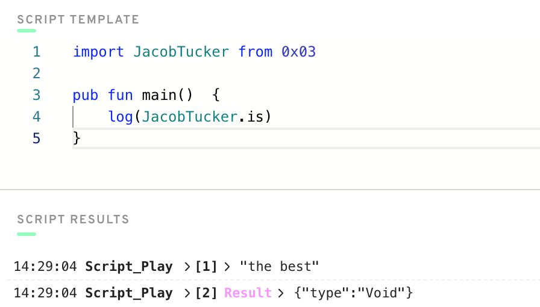

## Day 2 

1. scripts <- cant change data in the account on blockchain 
2. AuthAccount <- gives details about who is authorising and allows for access of data in the account 
3. prepare <- can access data in account and call functions on smart contract: execute <- can only call functions 
```
pub contract HelloWorld {

    pub var greeting: String
    pub var myNumber: Int

    pub fun changeGreeting(newGreeting: String) {
        self.greeting = newGreeting
    }

    pub fun updateMyNumber(newNumber: Int) {
        self.myNumber = newNumber
    }

    init() {
        self.greeting = "Hello, World!"
        self.myNumber = 0
    }
}
--------------------------------
import HelloWorld from 0x01

transaction(myNewNumber: Int) {
    prepare(account: AuthAccount) {}
    execute{
        HelloWorld.updateMyNumber(newNumber: myNewNumber)
    }
}
```
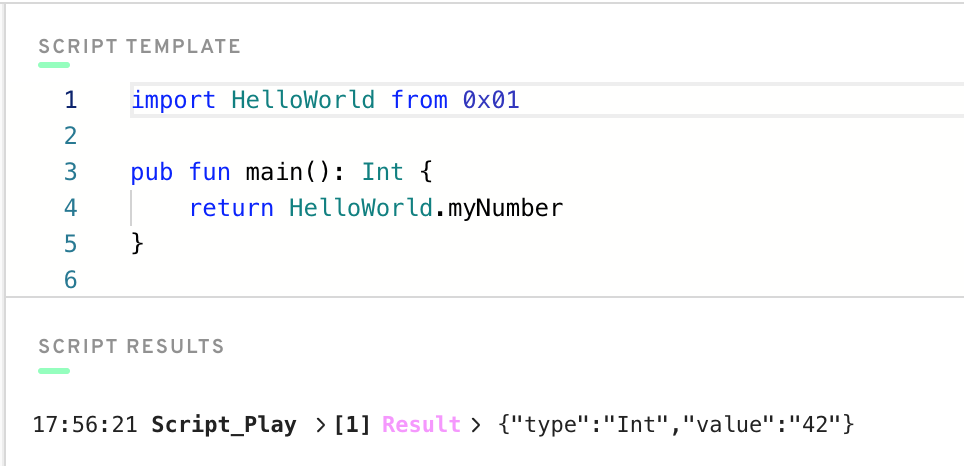


## Day 3 

1. array
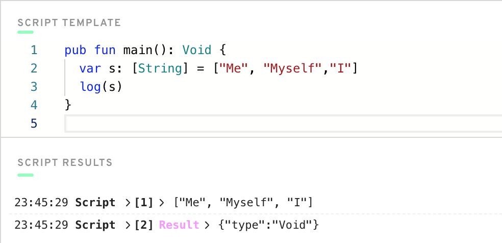

2.
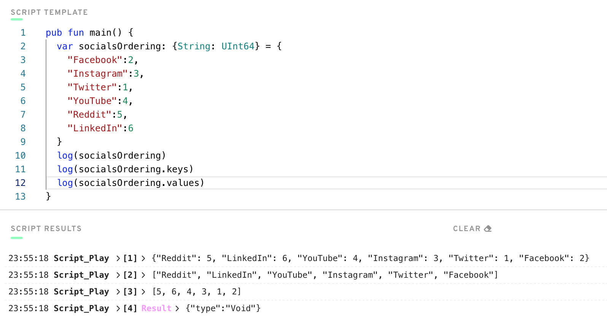

3. It removes the optional from a type that allows it to take the value type or nil. For example reading object values returns the optional type so using ! forces it to be the type only. If nil is return program panics and stops execution. 
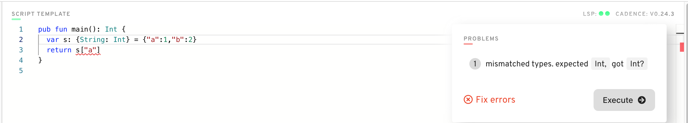

4. It implies the return type which is optional String is not what is stated as return which is String type. We can fix it by unwrapping or returning Optional String
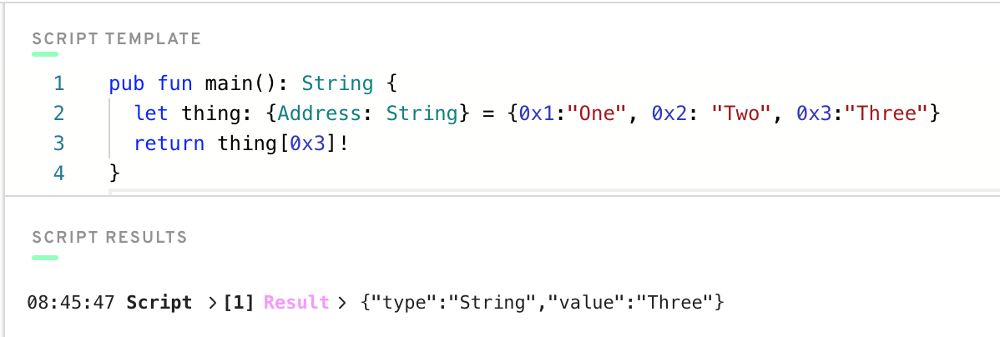
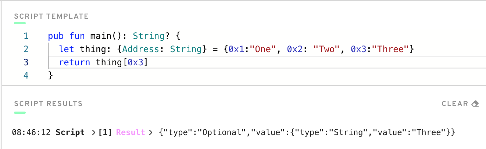

## Day 4 

```
pub contract BankAccount {

    pub var profiles: {Address: AccountProfile}
    
    pub struct AccountProfile {
        pub let fullName: String
        pub let birthday: String
        pub let type: String
        pub let amount: Int
        pub let account: Address

        init(_fullName: String, _birthday: String,_type: String, _account: Address) {
            self.fullName = _fullName
            self.birthday = _birthday
            self.type = _type
            self.amount = 0
            self.account = _account
        }
    }

    pub fun addProfile(fullName: String, birthday: String, type: String, account: Address) {
        let newAccountProfile = AccountProfile(_fullName: fullName, _birthday: birthday, _type: type, _account: account)
        self.profiles[account] = newAccountProfile
    }

    init() {
        self.profiles = {}
    }

}
```
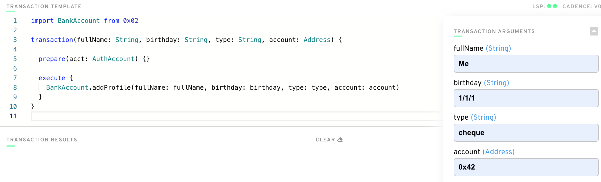
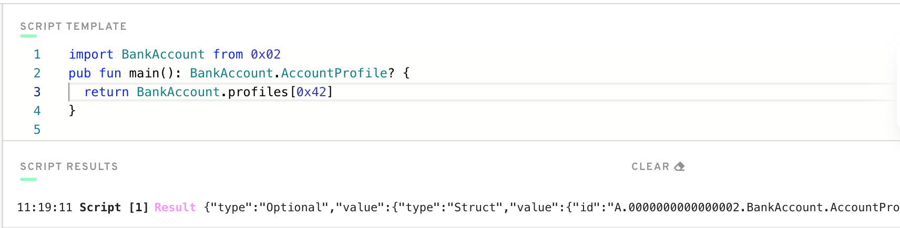

# Chapter 3

## Day 1

List 3 reasons why structs are different from resources.
1. (a) Structs can be copied easily whereas resources can't be copied need to be moved around
   (b) Structs can be created inside and outside contracts whereas resources can only be created inside contracts
   (c) Structs can be handled anyhow can be lost, overwritten easily destroyed whereas resources are a bit more complex to deal with and must be handled explicitly 
   
Describe a situation where a resource might be better to use than a struct.
2. When dealing with something that requires more complex access control is unique must not be easily copied or lost. This can be well suited to NFT's Non Fungile Tokens.

3. Keword to create new resources = create

4. Resources can only be created in a contract and never in a script or transaction

5 @Jacob type of resource

6. Fixed contract below
```
pub contract Test {

    // Hint: There's nothing wrong here ;)
    pub resource Jacob {
        pub let rocks: Bool
        init() {
            self.rocks = true
        }
    }

    pub fun createJacob(): @Jacob { // @ specifies resources
        let myJacob <- create Jacob() // resources are explicitly created and moved around
        return <- myJacob // resources explicity moved 
    }
}
```

## Day 2

Places can store resources - contract variable, dictionary, array, another resource 

1. Contract with array and dictionary of resources 
```
pub contract TokensContract {
 
   pub var arrayOfTokens: @[Token]
   pub var dictionaryOfTokens: @{String: Token}
 
   pub var sizeArray: Int
   pub var sizeDict: Int
 
   pub resource Token {
       pub let name: String
       init(name: String) {
           self.name = name
       }
   }
 
   pub fun addTokenArray(token: @Token): Bool {
       self.arrayOfTokens.append(<- token)
       self.sizeArray= self.sizeArray + 1
       return true
   }
 
   pub fun removeTokenArray(index: Int): @Token {
       pre { index >= 0 && index < self.sizeArray}
       self.sizeArray= self.sizeArray - 1
       return <- self.arrayOfTokens.remove(at: index)
   }
 
   pub fun addTokenDictionary(token: @Token) : Bool {
       var key: String = token.name
       // var key: Uint64 = token.uuid. -> can use more unique key than ame, however this is for example purposes only 
       self.dictionaryOfTokens[key] <-! token // Force move - panic if there is already another resource
       /*
       option to handle where there is a value already
       option to use double move
       let oldToken <- self.dictionaryOfTokens[key] <- token
       destroy oldToken
       */
       self.sizeDict= self.sizeDict + 1
       return true
   }
 
   pub fun removeTokenDictionaryReturnToken(key: String) : @Token {
       self.sizeDict= self.sizeDict - 1
       let token: @Token <- self.dictionaryOfTokens.remove(key: key) ?? panic("Could not find token!")
       return <- token
   }
 
   pub fun removeTokenDictionaryReturnBool(key:String) : Bool {
       let removed: @Token <- self.dictionaryOfTokens.remove(key:key)?? panic("Could not find token!")
       self.sizeDict= self.sizeDict - 1
       destroy removed
       return true
   }
 
   init() {
       self.arrayOfTokens <- []
       self.dictionaryOfTokens <- {}
       self.sizeArray = 0
       self.sizeDict = 0
   }
 
}

```

## Day 3

1. Define your own contract that stores a dictionary of resources. Add a function to get a reference to one of the resources in the dictionary.
```
pub contract ContractStudentResources {

    pub var dictionaryOfStudents: @{UInt64: Student}

    pub resource Student {
        pub var firstname: String
        pub var surname: String
        pub var course: String
        pub var age: UInt64

        init(firstname: String, surname: String, course: String, age: UInt64) {
            self.firstname = firstname
            self.surname = surname
            self.course = course
            self.age = age
        }
    }

    pub fun addStudent(firstname: String, surname: String, course: String, age: UInt64) : UInt64 {
        let student <- create Student(firstname:firstname, surname:surname, course:course, age:age)
        let id = student.uuid
        self.dictionaryOfStudents[id] <-! student
        return id
    }

    pub fun getStudent(id: UInt64): &Student? {
        return &self.dictionaryOfStudents[id] as &Student?
        // unwrap optional reference ==> return (&self.dictionaryOfStudents[key] as &Greeting?)! 
    }

    init() {
        self.dictionaryOfStudents <- {}
    }
}
```

2. Create a script that reads information from that resource using the reference from the function you defined in part 1
```
import ContractStudentResources from 0x01

pub fun main(): [AnyStruct] {
  let studentId: UInt64 = ContractStudentResources.addStudent("John","James", "Cadence",5)
  let student: &ContractStudentResources.Student = ContractStudentResources.getStudent(studentId)
  return [student.firstname, student.surname, student.course, student.age]
}
```

3. Explain, in your own words, why references can be useful in Cadence.
References help reduce the complexity associated with handling resources as we can work with them using references without having to move them around. 

## Day 4

1. Use resource interface
(a) To define how a resource must be implemented (b) To restrict access

2.Define your own contract. Make your own resource interface and a resource that implements the interface. Create 2 functions. In the 1st function, show an example of not restricting the type of the resource and accessing its content. In the 2nd function, show an example of restricting the type of the resource and NOT being able to access its content.
```
pub contract HelloWorld {

    pub resource interface IGreeting {
      pub var greeting: String
      pub var version: Int
    }

    pub resource Greeting: IGreeting {
      pub var greeting: String
      pub var version: Int

      pub fun updateGreeting(newGreeting: String): Int {
        self.greeting = newGreeting
        self.version = self.version + 1
        return self.version  // returns the new version
      }

      init() {
        self.greeting = "Hello World"
        self.version = 1
      }
    }

    pub fun noInterface() {
      let _greeting: @Greeting <- create Greeting()
      log(_greeting.greeting) // Should be "Hello World"
      log(_greeting.version) // 1
      var result = _greeting.updateGreeting(newGreeting: "Already Said Hello")
      log(_greeting.greeting) // Should be "Already Said Hello"
      log(result) // Should be 2
      destroy _greeting
    }

    pub fun yesInterface() {
      let _greeting: @Greeting{IGreeting} <- create Greeting()
      log(_greeting.greeting) // Should be "Hello World"
      log(_greeting.version) // Should be 1
      var result = _greeting.updateGreeting(newGreeting: "Already Said Hello") 
      log(_greeting.version) // Should be 1 as no change.
      log(_greeting.greeting) // Hello World as no 
      destroy _greeting
    }

    init() {
    }
}
```

3. Fixed code 
```
pub contract Stuff {

    pub struct interface ITest {
      pub var greeting: String
      pub var favouriteFruit: String
      pub fun changeGreeting(newGreeting:String): String // added to interface to fixe error
    }

    // `structure Stuff.Test does not conform 
    // to structure interface Stuff.ITest`
    pub struct Test: ITest {
      pub var greeting: String
      pub var favouriteFruit: String
      pub fun changeGreeting(newGreeting: String): String {
        self.greeting = newGreeting
        return self.greeting // returns the new greeting
      }

      init() {
        self.greeting = "Hello!"
        self.favouriteFruit = "Fruit"
      }
    }

    pub fun fixThis() {
      let test: Test{ITest} = Test()
      let newGreeting = test.changeGreeting(newGreeting: "Bonjour!") // ERROR HERE: `member of restricted type is not accessible: changeGreeting`
      log(newGreeting)
    }
}
```

## Day 5

Access Control 
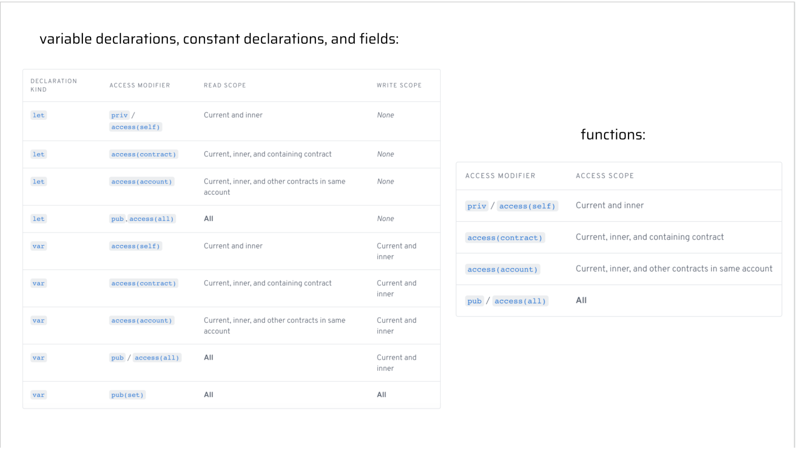

-- Ordered Least Restrictive to Most Restritive --
1.  pub(set) => [Write Scope - All Scope] + [Read Scope - All Scope]

2. access(all) => [Write Scope - Current & Inner] + [Read Scope - All Scope]
3. pub => [Write Scope Current & Inner] + [Read Scope - All Scope]

4. access(account) => [Write Scope - Current & Inner] + [Read Scope - All Contracts in the Account]
5. access(contract) => [Write Scope - Current & Inner] + [Read Scope - Containing Contract]

6. access(self) => [Write Scope - Current & Inner] + [Read Scope - Current & Inner]
7.  priv => [Write Scope - Current & Inner] + [Read Scope - Current & Inner]

Scope and accesses
1. Variable a => [Write Scope - Area 1, Area2, Area3, Area4] + [Read Scope - Area 1, Area2, Area3, Area4]
2. Variable b => [Write Scope - Area1] + [Read Scope - Area 1, Area2, Area3, Area4]
3. Variable c => [Write Scope - Area1] + [Read Scope - Area 1, Area2, Area3]
4. Variable d => [Write Scope - Area1] + [Read Scope - Area1]

5. publicFunc => Access [Area1 Area2, Area3, Area4]
6. contractFunc  => [Area1, Area2, Area3]
7. privateFunc => [Area1]

# Chapter 4

## Day 1 

1. Explain what lives inside of an account.
- Contract code(account can store multiple contracts) + Storage (/storage/PATH_NAME, public/PATH_NAME, private/PATH_NAME)stores data 

2. What is the difference between the /storage/, /public/, and /private/ paths?
/storage/ - is where data in account is first placed, it is only accessble by the account owner
/public/ - is where account owner exposes data to the public 
/private/ - is storage where owner grants access to some so is most restrictive access storage

3. What does .save() do? What does .load() do? What does .borrow() do?
.save() - stores data in account storage so takes parameters(data, storage/PATH_NAME)
.load() - retrieves and takes out data from account storage takes parameter(from: storage/PATH_NAME)
.borrow() - allows looking at data without taking it out from storage by making use of references it takes parameter(from: STORAGE_PATH)

4. Explain why we couldn't save something to our account storage inside of a script.
Inside a script we dont have access to the AuthAccount which is that part of your account that signs and is used to access data in your storage. AuthAccount is only exposed in the prepare(signer: AuthAccount) {} part of a transaction

5. Explain why I couldn't save something to your account.
As you would not have AuthAccount access to anothers account. Storage is only accessed via AuthAccount.

6. Define a contract that returns a resource that has at least 1 field in it. Then, write 2 transactions:
A transaction that first saves the resource to account storage, then loads it out of account storage, logs a field inside the resource, and destroys it.
A transaction that first saves the resource to account storage, then borrows a reference to it, and logs a field inside the resource.

Contract
```
pub contract ReturnResource {

    pub resource Resource {

      pub var oneResource: Int

      init() {
        self.oneResource = 1
      }

    }

    pub fun createResource(): @Resource {
        return <- create Resource()
    }

    init() {
    }

}

```
Transaction 1
```
import ReturnResource from 0x03

transaction {

  prepare(acct: AuthAccount) {
    //store Resource in storage
    acct.save(<-ReturnResource.createResource(),to: /storage/Resource)
    let resource: @ReturnResource.Resource <- 
    acct.load<@ReturnResource.Resource>(from: /storage/Resource) ??
    panic("No resource found at that location")
    log(resource.oneResource)
    destroy resource
  }

  execute {
    log("Stored Resource in Storage")
    log("Loaded Resource from Storage")
    log("Read resource field")
    log("Destroyed resource")
  }
}

```
Transaction 2
```
import ReturnResource from 0x03

transaction {

  prepare(acct: AuthAccount) {
    //store Resource in storage
    acct.save(<-ReturnResource.createResource(),to: /storage/Resource)
    let resource: &ReturnResource.Resource = 
    acct.borrow<&ReturnResource.Resource>(from: /storage/Resource) ??
    panic("No resource found at that location")
    log(resource.oneResource)
  }

  execute {
    log("Stored Resource in Storage")
    log("Borrowed Reference Resource from Storage")
    log("Read resource field from reference")
  }
}

```

## Day 2

In the example above, we used the .link() function to "link" our resource to the /public/ path. In simpler terms, we took the thing at /storage/MyTestResource and exposed a &Stuff.Test to the public so they can read from it.

Linking something to /public/ or /private/ creates a capability <- they are like pointers

AuthAccount - you can do anything e.g change storage. PublicAccount - for public part account so can expose what public can read e.g via interfaces
You can only get a capability from /private/ with a AuthAccount, whereas from /publi/ with a PublicAccount
Example => Public
```
import Stuff from 0x01
pub fun main(address: Address): String {
  // gets the public capability that is pointing to a `&Stuff.Test` type
  let publicCapability: Capability<&Stuff.Test> =
    getAccount(address).getCapability<&Stuff.Test>(/public/MyTestResource)

  // Borrow the `&Stuff.Test` from the public capability
  let testResource: &Stuff.Test = publicCapability.borrow() ?? panic("The capability doesn't exist or you did not specify the right type when you got the capability.")

  return testResource.name // "Jacob"
}
```
//.borrow() does not need to specify type as the capability already has type
// Restrict with resource interface => signer.link<&Stuff.Test{Stuff.ITest}>(/public/MyTestResource, target: /storage/MyTestResource)
// let account: PublicAccount = getAccount(0x1) -> `account` now holds the PublicAccount of address 0x1

1. .link() -> allows us to expose data or resource in storage of our account publicly or privately 

2. By Setting the type as restricted to the interface when we link our stored data, only functions and variables in the restricted interface are accessible. 

3. Deploy a contract that contains a resource that implements a resource interface. Then, do the following:
```
pub contract ReturnResource {

    pub resource interface IResource {
      pub var oneResource: Int
    }

    pub resource Resource: IResource {

      pub var oneResource: Int
      pub var oneOwner: String

      pub fun changeOneResource() {
        self.oneResource = 2
      }

      init() {
        self.oneResource = 1
        self.oneOwner = "You wont know"
      }

    }

    pub fun createResource(): @Resource {
        return <- create Resource()
    }

    init() {
    }

}
```

In a transaction, save the resource to storage and link it to the public with the restrictive interface.
```
import ReturnResource from 0x03

transaction {

  prepare(acct: AuthAccount) {
    //store Resource in storage
    acct.save(<-ReturnResource.createResource(),to: /storage/Resource)
    acct.link<&ReturnResource.Resource{ReturnResource.IResource}>
    (/public/Resource, target: /storage/Resource)
  }

  execute {
    log("Stored Resource in Storage")
    log("Linked Resource with Restrictive Interface")
  }
}
```

```
import ReturnResource from 0x03

pub fun main(address: Address) {

    // get account capability 
    let capabilityPublic: Capability<&ReturnResource.Resource{ReturnResource.IResource}> 
    = getAccount(address).getCapability<&ReturnResource.Resource{ReturnResource.IResource}>
    (/public/Resource)

    // log(capabilityPublic) <- Capability
    
    let resourceRef: &ReturnResource.Resource{ReturnResource.IResource} = capabilityPublic.borrow()
     ?? panic("The capability doesn't exist or you did not specify the right type when you got the capability.")
    
    // log(resourceRef) <- StorageReference()

     //resourceRef.changeOneResource()
     //log(resourceRef.oneOwner)
     log(resourceRef.oneResource)

}
```
Run a script that tries to access a non-exposed field in the resource interface, and see the error pop up
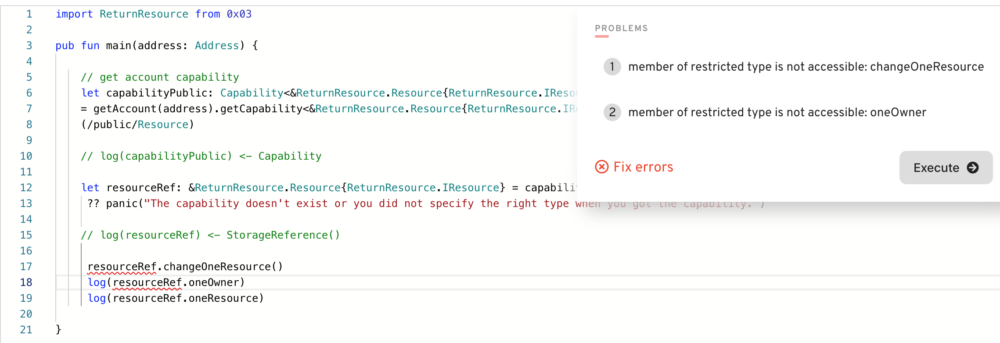
Run the script and access something you CAN read from. Return it from the script.
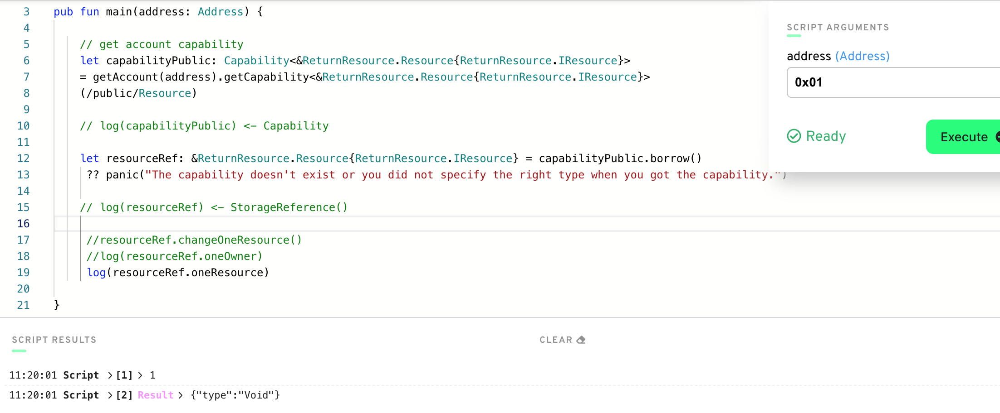


## Day 3

## Day 4
