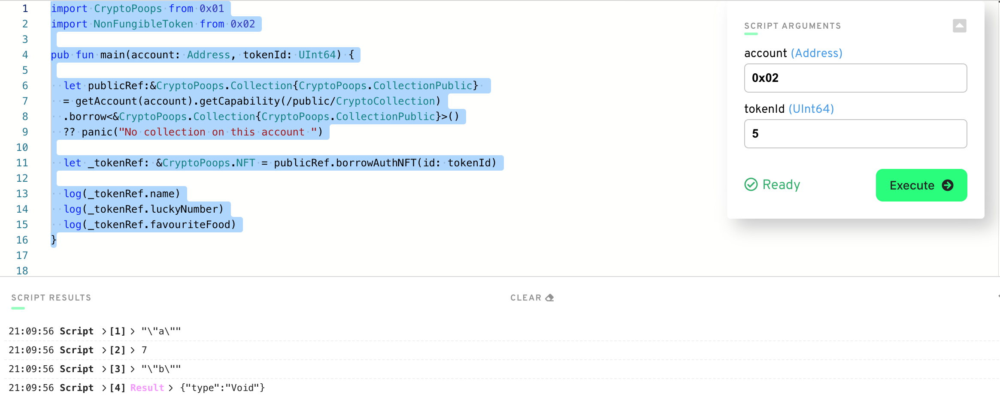

# Quest_Submissions_Flow

# Chapter 1 

## Day 1 

1. A distributed immutable database that uses incentive schemes to ensure nont trusting parties can use the system assured that there is a single source of truth. The blocks or containers or storage of data is such that past history is linked to current data through proofs for exampel cryptographic that ensure its hard to change data hence immutability. 
2. Smart contract is just code that leaves on the blockchain and allows for reading and writing to the blockchain to achieve some desired functionalities
3. A script can only read from the Flow Blockchain is free whereas a Transaction can write or read data to the Flow Blockchain and costs money 

## Day 2

1. Safety + Security; Clarity; Developer Experience; Approachability; Resource Oriented Programming;
2. To ensure developers can quickly be onboarded to create secure smart contracts that are reliable and easy to reason about 

# Chapter 2

## Day 1 

Deploy contract + Read
```
access(all) contract JacobTucker {

  // Declare a public field of type String.
  //
  // All fields must be initialized in the init() function.
  access(all) let is: String

  // The init() function is required if the contract contains any fields.
  init() {
      self.is =  "the best"
  }
  
}
------------------
import JacobTucker from 0x03

pub fun main()  {
    log(JacobTucker.is)
}
```


## Day 2 

1. scripts <- cant change data in the account on blockchain 
2. AuthAccount <- gives details about who is authorising and allows for access of data in the account 
3. prepare <- can access data in account and call functions on smart contract: execute <- can only call functions 
```
pub contract HelloWorld {

    pub var greeting: String
    pub var myNumber: Int

    pub fun changeGreeting(newGreeting: String) {
        self.greeting = newGreeting
    }

    pub fun updateMyNumber(newNumber: Int) {
        self.myNumber = newNumber
    }

    init() {
        self.greeting = "Hello, World!"
        self.myNumber = 0
    }
}
--------------------------------
import HelloWorld from 0x01

transaction(myNewNumber: Int) {
    prepare(account: AuthAccount) {}
    execute{
        HelloWorld.updateMyNumber(newNumber: myNewNumber)
    }
}
```


## Day 3 

1. array


2.


3. It removes the optional from a type that allows it to take the value type or nil. For example reading object values returns the optional type so using ! forces it to be the type only. If nil is return program panics and stops execution. 


4. It implies the return type which is optional String is not what is stated as return which is String type. We can fix it by unwrapping or returning Optional String


## Day 4 

```
pub contract BankAccount {

    pub var profiles: {Address: AccountProfile}
    
    pub struct AccountProfile {
        pub let fullName: String
        pub let birthday: String
        pub let type: String
        pub let amount: Int
        pub let account: Address

        init(_fullName: String, _birthday: String,_type: String, _account: Address) {
            self.fullName = _fullName
            self.birthday = _birthday
            self.type = _type
            self.amount = 0
            self.account = _account
        }
    }

    pub fun addProfile(fullName: String, birthday: String, type: String, account: Address) {
        let newAccountProfile = AccountProfile(_fullName: fullName, _birthday: birthday, _type: type, _account: account)
        self.profiles[account] = newAccountProfile
    }

    init() {
        self.profiles = {}
    }

}
```


# Chapter 3

## Day 1

List 3 reasons why structs are different from resources.
1. (a) Structs can be copied easily whereas resources can't be copied need to be moved around
   (b) Structs can be created inside and outside contracts whereas resources can only be created inside contracts
   (c) Structs can be handled anyhow can be lost, overwritten easily destroyed whereas resources are a bit more complex to deal with and must be handled explicitly 
   
Describe a situation where a resource might be better to use than a struct.
2. When dealing with something that requires more complex access control is unique must not be easily copied or lost. This can be well suited to NFT's Non Fungile Tokens.

3. Keword to create new resources = create

4. Resources can only be created in a contract and never in a script or transaction

5 @Jacob type of resource

6. Fixed contract below
```
pub contract Test {

    // Hint: There's nothing wrong here ;)
    pub resource Jacob {
        pub let rocks: Bool
        init() {
            self.rocks = true
        }
    }

    pub fun createJacob(): @Jacob { // @ specifies resources
        let myJacob <- create Jacob() // resources are explicitly created and moved around
        return <- myJacob // resources explicity moved 
    }
}
```

## Day 2

Places can store resources - contract variable, dictionary, array, another resource 

1. Contract with array and dictionary of resources 
```
pub contract TokensContract {
 
   pub var arrayOfTokens: @[Token]
   pub var dictionaryOfTokens: @{String: Token}
 
   pub var sizeArray: Int
   pub var sizeDict: Int
 
   pub resource Token {
       pub let name: String
       init(name: String) {
           self.name = name
       }
   }
 
   pub fun addTokenArray(token: @Token): Bool {
       self.arrayOfTokens.append(<- token)
       self.sizeArray= self.sizeArray + 1
       return true
   }
 
   pub fun removeTokenArray(index: Int): @Token {
       pre { index >= 0 && index < self.sizeArray}
       self.sizeArray= self.sizeArray - 1
       return <- self.arrayOfTokens.remove(at: index)
   }
 
   pub fun addTokenDictionary(token: @Token) : Bool {
       var key: String = token.name
       // var key: Uint64 = token.uuid. -> can use more unique key than ame, however this is for example purposes only 
       self.dictionaryOfTokens[key] <-! token // Force move - panic if there is already another resource
       /*
       option to handle where there is a value already
       option to use double move
       let oldToken <- self.dictionaryOfTokens[key] <- token
       destroy oldToken
       */
       self.sizeDict= self.sizeDict + 1
       return true
   }
 
   pub fun removeTokenDictionaryReturnToken(key: String) : @Token {
       self.sizeDict= self.sizeDict - 1
       let token: @Token <- self.dictionaryOfTokens.remove(key: key) ?? panic("Could not find token!")
       return <- token
   }
 
   pub fun removeTokenDictionaryReturnBool(key:String) : Bool {
       let removed: @Token <- self.dictionaryOfTokens.remove(key:key)?? panic("Could not find token!")
       self.sizeDict= self.sizeDict - 1
       destroy removed
       return true
   }
 
   init() {
       self.arrayOfTokens <- []
       self.dictionaryOfTokens <- {}
       self.sizeArray = 0
       self.sizeDict = 0
   }
 
}

```

## Day 3

1. Define your own contract that stores a dictionary of resources. Add a function to get a reference to one of the resources in the dictionary.
```
pub contract ContractStudentResources {

    pub var dictionaryOfStudents: @{UInt64: Student}

    pub resource Student {
        pub var firstname: String
        pub var surname: String
        pub var course: String
        pub var age: UInt64

        init(firstname: String, surname: String, course: String, age: UInt64) {
            self.firstname = firstname
            self.surname = surname
            self.course = course
            self.age = age
        }
    }

    pub fun addStudent(firstname: String, surname: String, course: String, age: UInt64) : UInt64 {
        let student <- create Student(firstname:firstname, surname:surname, course:course, age:age)
        let id = student.uuid
        self.dictionaryOfStudents[id] <-! student
        return id
    }

    pub fun getStudent(id: UInt64): &Student? {
        return &self.dictionaryOfStudents[id] as &Student?
        // unwrap optional reference ==> return (&self.dictionaryOfStudents[key] as &Greeting?)! 
    }

    init() {
        self.dictionaryOfStudents <- {}
    }
}
```

2. Create a script that reads information from that resource using the reference from the function you defined in part 1
```
import ContractStudentResources from 0x01

pub fun main(): [AnyStruct] {
  let studentId: UInt64 = ContractStudentResources.addStudent("John","James", "Cadence",5)
  let student: &ContractStudentResources.Student = ContractStudentResources.getStudent(studentId)
  return [student.firstname, student.surname, student.course, student.age]
}
```

3. Explain, in your own words, why references can be useful in Cadence.
References help reduce the complexity associated with handling resources as we can work with them using references without having to move them around. 

## Day 4

1. Use resource interface
(a) To define how a resource must be implemented (b) To restrict access

2.Define your own contract. Make your own resource interface and a resource that implements the interface. Create 2 functions. In the 1st function, show an example of not restricting the type of the resource and accessing its content. In the 2nd function, show an example of restricting the type of the resource and NOT being able to access its content.
```
pub contract HelloWorld {

    pub resource interface IGreeting {
      pub var greeting: String
      pub var version: Int
    }

    pub resource Greeting: IGreeting {
      pub var greeting: String
      pub var version: Int

      pub fun updateGreeting(newGreeting: String): Int {
        self.greeting = newGreeting
        self.version = self.version + 1
        return self.version  // returns the new version
      }

      init() {
        self.greeting = "Hello World"
        self.version = 1
      }
    }

    pub fun noInterface() {
      let _greeting: @Greeting <- create Greeting()
      log(_greeting.greeting) // Should be "Hello World"
      log(_greeting.version) // 1
      var result = _greeting.updateGreeting(newGreeting: "Already Said Hello")
      log(_greeting.greeting) // Should be "Already Said Hello"
      log(result) // Should be 2
      destroy _greeting
    }

    pub fun yesInterface() {
      let _greeting: @Greeting{IGreeting} <- create Greeting()
      log(_greeting.greeting) // Should be "Hello World"
      log(_greeting.version) // Should be 1
      var result = _greeting.updateGreeting(newGreeting: "Already Said Hello") 
      log(_greeting.version) // Should be 1 as no change.
      log(_greeting.greeting) // Hello World as no 
      destroy _greeting
    }

    init() {
    }
}
```

3. Fixed code 
```
pub contract Stuff {

    pub struct interface ITest {
      pub var greeting: String
      pub var favouriteFruit: String
      pub fun changeGreeting(newGreeting:String): String // added to interface to fixe error
    }

    // `structure Stuff.Test does not conform 
    // to structure interface Stuff.ITest`
    pub struct Test: ITest {
      pub var greeting: String
      pub var favouriteFruit: String
      pub fun changeGreeting(newGreeting: String): String {
        self.greeting = newGreeting
        return self.greeting // returns the new greeting
      }

      init() {
        self.greeting = "Hello!"
        self.favouriteFruit = "Fruit"
      }
    }

    pub fun fixThis() {
      let test: Test{ITest} = Test()
      let newGreeting = test.changeGreeting(newGreeting: "Bonjour!") // ERROR HERE: `member of restricted type is not accessible: changeGreeting`
      log(newGreeting)
    }
}
```

## Day 5

Access Control 


-- Ordered Least Restrictive to Most Restritive --
1.  pub(set) => [Write Scope - All Scope] + [Read Scope - All Scope]

2. access(all) => [Write Scope - Current & Inner] + [Read Scope - All Scope]
3. pub => [Write Scope Current & Inner] + [Read Scope - All Scope]

4. access(account) => [Write Scope - Current & Inner] + [Read Scope - All Contracts in the Account]
5. access(contract) => [Write Scope - Current & Inner] + [Read Scope - Containing Contract]

6. access(self) => [Write Scope - Current & Inner] + [Read Scope - Current & Inner]
7.  priv => [Write Scope - Current & Inner] + [Read Scope - Current & Inner]

Scope and accesses
1. Variable a => [Write Scope - Area 1, Area2, Area3, Area4] + [Read Scope - Area 1, Area2, Area3, Area4]
2. Variable b => [Write Scope - Area1] + [Read Scope - Area 1, Area2, Area3, Area4]
3. Variable c => [Write Scope - Area1] + [Read Scope - Area 1, Area2, Area3]
4. Variable d => [Write Scope - Area1] + [Read Scope - Area1]

5. publicFunc => Access [Area1 Area2, Area3, Area4]
6. contractFunc  => [Area1, Area2, Area3]
7. privateFunc => [Area1]

# Chapter 4

## Day 1 

1. Explain what lives inside of an account.
- Contract code(account can store multiple contracts) + Storage (/storage/PATH_NAME, public/PATH_NAME, private/PATH_NAME)stores data 

2. What is the difference between the /storage/, /public/, and /private/ paths?
/storage/ - is where data in account is first placed, it is only accessble by the account owner
/public/ - is where account owner exposes data to the public 
/private/ - is storage where owner grants access to some so is most restrictive access storage

3. What does .save() do? What does .load() do? What does .borrow() do?
.save() - stores data in account storage so takes parameters(data, storage/PATH_NAME)
.load() - retrieves and takes out data from account storage takes parameter(from: storage/PATH_NAME)
.borrow() - allows looking at data without taking it out from storage by making use of references it takes parameter(from: STORAGE_PATH)

4. Explain why we couldn't save something to our account storage inside of a script.
Inside a script we dont have access to the AuthAccount which is that part of your account that signs and is used to access data in your storage. AuthAccount is only exposed in the prepare(signer: AuthAccount) {} part of a transaction

5. Explain why I couldn't save something to your account.
As you would not have AuthAccount access to anothers account. Storage is only accessed via AuthAccount.

6. Define a contract that returns a resource that has at least 1 field in it. Then, write 2 transactions:
A transaction that first saves the resource to account storage, then loads it out of account storage, logs a field inside the resource, and destroys it.
A transaction that first saves the resource to account storage, then borrows a reference to it, and logs a field inside the resource.

Contract
```
pub contract ReturnResource {

    pub resource Resource {

      pub var oneResource: Int

      init() {
        self.oneResource = 1
      }

    }

    pub fun createResource(): @Resource {
        return <- create Resource()
    }

    init() {
    }

}

```
Transaction 1
```
import ReturnResource from 0x03

transaction {

  prepare(acct: AuthAccount) {
    //store Resource in storage
    acct.save(<-ReturnResource.createResource(),to: /storage/Resource)
    let resource: @ReturnResource.Resource <- 
    acct.load<@ReturnResource.Resource>(from: /storage/Resource) ??
    panic("No resource found at that location")
    log(resource.oneResource)
    destroy resource
  }

  execute {
    log("Stored Resource in Storage")
    log("Loaded Resource from Storage")
    log("Read resource field")
    log("Destroyed resource")
  }
}

```
Transaction 2
```
import ReturnResource from 0x03

transaction {

  prepare(acct: AuthAccount) {
    //store Resource in storage
    acct.save(<-ReturnResource.createResource(),to: /storage/Resource)
    let resource: &ReturnResource.Resource = 
    acct.borrow<&ReturnResource.Resource>(from: /storage/Resource) ??
    panic("No resource found at that location")
    log(resource.oneResource)
  }

  execute {
    log("Stored Resource in Storage")
    log("Borrowed Reference Resource from Storage")
    log("Read resource field from reference")
  }
}

```

## Day 2

In the example above, we used the .link() function to "link" our resource to the /public/ path. In simpler terms, we took the thing at /storage/MyTestResource and exposed a &Stuff.Test to the public so they can read from it.

Linking something to /public/ or /private/ creates a capability <- they are like pointers

AuthAccount - you can do anything e.g change storage. PublicAccount - for public part account so can expose what public can read e.g via interfaces
You can only get a capability from /private/ with a AuthAccount, whereas from /publi/ with a PublicAccount
Example => Public
```
import Stuff from 0x01
pub fun main(address: Address): String {
  // gets the public capability that is pointing to a `&Stuff.Test` type
  let publicCapability: Capability<&Stuff.Test> =
    getAccount(address).getCapability<&Stuff.Test>(/public/MyTestResource)

  // Borrow the `&Stuff.Test` from the public capability
  let testResource: &Stuff.Test = publicCapability.borrow() ?? panic("The capability doesn't exist or you did not specify the right type when you got the capability.")

  return testResource.name // "Jacob"
}
```
//.borrow() does not need to specify type as the capability already has type
// Restrict with resource interface => signer.link<&Stuff.Test{Stuff.ITest}>(/public/MyTestResource, target: /storage/MyTestResource)
// let account: PublicAccount = getAccount(0x1) -> `account` now holds the PublicAccount of address 0x1

1. .link() -> allows us to expose data or resource in storage of our account publicly or privately 

2. By Setting the type as restricted to the interface when we link our stored data, only functions and variables in the restricted interface are accessible. 

3. Deploy a contract that contains a resource that implements a resource interface. Then, do the following:
```
pub contract ReturnResource {

    pub resource interface IResource {
      pub var oneResource: Int
    }

    pub resource Resource: IResource {

      pub var oneResource: Int
      pub var oneOwner: String

      pub fun changeOneResource() {
        self.oneResource = 2
      }

      init() {
        self.oneResource = 1
        self.oneOwner = "You wont know"
      }

    }

    pub fun createResource(): @Resource {
        return <- create Resource()
    }

    init() {
    }

}
```

In a transaction, save the resource to storage and link it to the public with the restrictive interface.
```
import ReturnResource from 0x03

transaction {

  prepare(acct: AuthAccount) {
    //store Resource in storage
    acct.save(<-ReturnResource.createResource(),to: /storage/Resource)
    acct.link<&ReturnResource.Resource{ReturnResource.IResource}>
    (/public/Resource, target: /storage/Resource)
  }

  execute {
    log("Stored Resource in Storage")
    log("Linked Resource with Restrictive Interface")
  }
}
```

```
import ReturnResource from 0x03

pub fun main(address: Address) {

    // get account capability 
    let capabilityPublic: Capability<&ReturnResource.Resource{ReturnResource.IResource}> 
    = getAccount(address).getCapability<&ReturnResource.Resource{ReturnResource.IResource}>
    (/public/Resource)

    // log(capabilityPublic) <- Capability
    
    let resourceRef: &ReturnResource.Resource{ReturnResource.IResource} = capabilityPublic.borrow()
     ?? panic("The capability doesn't exist or you did not specify the right type when you got the capability.")
    
    // log(resourceRef) <- StorageReference()

     //resourceRef.changeOneResource()
     //log(resourceRef.oneOwner)
     log(resourceRef.oneResource)

}
```
Run a script that tries to access a non-exposed field in the resource interface, and see the error pop up

Run the script and access something you CAN read from. Return it from the script.


## Day 3

1. Why did we add a Collection to this contract? List the two main reasons 
    1. To make it easier to manage various NFT’s from single storage path
    2. Storage can only be accessed by owner directly, however a collection in storage can allow for anyone to deposit or give us an NFT
2. What do you have to do if you have resources "nested" inside of another resource? ("Nested resources")
- Create a destroy function
3. Brainstorm some extra things we may want to add to this contract. Think about what might be problematic with this contract and how we could fix it.
  
  Idea #1: Do we really want everyone to be able to mint an NFT? => No as maybe we want fixed supply or control properties NFT etc so one authorised individuals. We can grant permissions or give access and or create an admin or minter role
  
  Idea #2: If we want to read information about our NFTs inside our Collection, right now we have to take it out of the Collection to do so. Is this good? => this is bad as it is resource intensive, can lead to loss of resource and is complex, we need to have a reference to resource so we can read it without taking it out. 

## Day 4

Commented Example CryptoPoops Code 
```
/*

Example simple NFT collection contract

*/

pub contract CryptoPoops {

  // keeps track total supply minted CryptoPoos
  pub var totalSupply: UInt64

  // This is an NFT resource that contains an id, name, favouriteFood, and luckyNumber
  pub resource NFT {
    
    // unique id of each NFT in this case uuid automatically given
    pub let id: UInt64
    
    // name property of NFT
    pub let name: String
    // favoritFoof property of NFT
    pub let favouriteFood: String
    // lucky number property of NFT
    pub let luckyNumber: Int
     
    // required initializer function akin to constructor to initialize resource variables with init inputs
    init(_name: String, _favouriteFood: String, _luckyNumber: Int) {
      // set id property to unique id
      self.id = self.uuid
      // set name property 
      self.name = _name
      // set favorite food property
      self.favouriteFood = _favouriteFood
      // set lucky number property 
      self.luckyNumber = _luckyNumber
    }
  }

  // This is a resource interface that allows us to deposit, getIDs and borrowNFT
  // Borrow NFT allows us to access NFT without withdrawing taking it out etc so we can read from it
  pub resource interface CollectionPublic {
    // expose function deposit to public
    pub fun deposit(token: @NFT)
    // expose getIDs to public
    pub fun getIDs(): [UInt64]
    // expose borrowNFt to public
    pub fun borrowNFT(id: UInt64): &NFT
  }
  
  // Resource that is a collection of minted NFTS
  pub resource Collection: CollectionPublic {

    // Dictionary to keep track of minted NFT's by id
    pub var ownedNFTs: @{UInt64: NFT}
    
    // Function to deposit an NFT into collection
    // Is also exposed by interface CollectionPublic
    pub fun deposit(token: @NFT) {
      self.ownedNFTs[token.id] <-! token
    }
    
    // Function to withdraw an NFT from collection
    // Is not exposed in interface CollectionPublic so cant be called by public
    pub fun withdraw(withdrawID: UInt64): @NFT {
      let nft <- self.ownedNFTs.remove(key: withdrawID) 
              ?? panic("This NFT does not exist in this Collection.")
      return <- nft
    }

    // Function to get array of NFTs owned by id
    // Is exposed in interface CollectionPublic so can be called by public
    pub fun getIDs(): [UInt64] {
      // return array of keys (Array.keys)
      return self.ownedNFTs.keys
    }
    
    // Function to borrow
    // Is exposed in interface CollectionPublic so can be called by public
    // Borrow NFT allows us to access NFT without withdrawing taking it out etc so we can read from it
    pub fun borrowNFT(id: UInt64): &NFT {
      // return reference to NFT with casting as NFT as we want to deal with this type for this contract
      return (&self.ownedNFTs[id] as &NFT?)!
    }

    // required initializer function akin to constructor to initialize resource variables 
    init() {
      // start with empty collection
      self.ownedNFTs <- {}
    }
    
    // Flow does not know how to destry resources within resources so need to create destroy function explicitly
    destroy() {
      // destroy collection resource
      destroy self.ownedNFTs
    }
  }
  
  // we cant call create outside contract so need to start with mepty collection to store an deposit NFTs
  pub fun createEmptyCollection(): @Collection {
    // creates a collection
    return <- create Collection()
  }
  
  // we dont want anyone to mint NFT;s by calling createNFT so only in resource Minter
  // create a Minter resource to create NFTs
  pub resource Minter {
    
    // function to create an NFT resource taking in NFT parameters
    pub fun createNFT(name: String, favouriteFood: String, luckyNumber: Int): @NFT {
      return <- create NFT(_name: name, _favouriteFood: favouriteFood, _luckyNumber: luckyNumber)
    }
    
    // function to create Minter
    pub fun createMinter(): @Minter {
      return <- create Minter()
    }

  }
  
  // initialize contract akin to a contructor called on creation
  init() {
    // keep track total supply minted NFT's with contract variable
    self.totalSupply = 0
    // create a capability/save Minter resource in storage so can be accessed and used to Mint tokens only by this account
    // only deployer of this contract will be able to mint tokens 
    self.account.save(<- create Minter(), to: /storage/Minter)
  }
}
```
--------------------------NON FUNGIBLE TOKEN NOTES---------------------------------------------------------------------------------------------------------

Example NFTToken with NonFungibleToken standard compliance
```
import NonFungibleToken from 0x02

/* 
Example NFT 
https://github.com/onflow/flow-nft/blob/master/contracts/ExampleNFT.cdc
*/
import NonFungibleToken from 0x02

pub contract SimpleNFT: NonFungibleToken {

    pub var totalSupply: UInt64
    pub let CollectionStoragePath: StoragePath
    pub let CollectionPublicPath: PublicPath
    pub let MinterStoragePath: StoragePath

    pub event ContractInitialized()
    pub event Withdraw(id: UInt64, from: Address?)
    pub event Deposit(id: UInt64, to: Address?)

    pub resource NFT: NonFungibleToken.INFT {      
        pub let id: UInt64
        init() {
            self.id = self.uuid
            SimpleNFT.totalSupply = SimpleNFT.totalSupply + (1 as UInt64)
        }
    }

    pub resource interface CollectionPublic {
        pub fun deposit(token: @NonFungibleToken.NFT)
        pub fun getIDs(): [UInt64]
        pub fun borrowNFT(id: UInt64): &NonFungibleToken.NFT
        pub fun borrowEntireNFT(id: UInt64): &SimpleNFT.NFT? {
            post {
                (result == nil) || (result?.id == id):
                    "Cannot borrow SimpleNFT reference: the ID of the returned reference is incorrect"
            }
        }
    }

    pub resource Collection: CollectionPublic, NonFungibleToken.Provider, NonFungibleToken.Receiver,NonFungibleToken.CollectionPublic {
        pub var ownedNFTs: @{UInt64: NonFungibleToken.NFT}
        pub fun withdraw(withdrawID: UInt64): @NonFungibleToken.NFT {
            let token <- self.ownedNFTs.remove(key: withdrawID) ?? panic("missing NFT")
            emit Withdraw(id: token.id, from: self.owner?.address)
            return <-token

        }
        pub fun deposit(token: @NonFungibleToken.NFT) {
            let token <- token as! @SimpleNFT.NFT
            let id: UInt64 = token.id
            let oldToken <- self.ownedNFTs[id] <- token
            emit Deposit(id: id, to: self.owner?.address)
            destroy oldToken
        }

        pub fun getIDs(): [UInt64] {
            return self.ownedNFTs.keys
        }

        pub fun borrowNFT(id: UInt64): &NonFungibleToken.NFT {
            return (&self.ownedNFTs[id] as &NonFungibleToken.NFT?)!
        }
 
        pub fun borrowEntireNFT(id: UInt64): &SimpleNFT.NFT? {
            if self.ownedNFTs[id] != nil {
                let ref = (&self.ownedNFTs[id] as auth &NonFungibleToken.NFT?)!
                return ref as! &SimpleNFT.NFT
            }
            return nil
        }

        init () {
            self.ownedNFTs <- {}
        }


        destroy() {
            destroy self.ownedNFTs
        }
    }

    pub fun createEmptyCollection(): @NonFungibleToken.Collection {
        return <- create Collection()
    }

    pub resource NFTMinter {
        pub fun mintNFT(recipient: &{NonFungibleToken.CollectionPublic}):
         UInt64 {
            let _token: @SimpleNFT.NFT <- create NFT()
            let _id: UInt64 = _token.uuid
            recipient.deposit(token: <- _token)
            return  _id
        }
        init() {
        }   
    }

    init() {
        self.totalSupply = 0   
        self.CollectionStoragePath = /storage/SimpleNFTCollection
        self.CollectionPublicPath = /public/SimpleNFTCollection
        self.MinterStoragePath = /storage/SimpleNFTMinter
        let collection <- create Collection()
        self.account.save(<-collection, to: self.CollectionStoragePath)

        self.account.link<&SimpleNFT.Collection{NonFungibleToken.CollectionPublic, 
SimpleNFT.CollectionPublic}>(
            self.CollectionPublicPath,
            target: self.CollectionStoragePath
        )

        let minter <- create NFTMinter()
        self.account.save(<-minter, to: self.MinterStoragePath)

        emit ContractInitialized()
    }
}
```

Example Transaction Minting

```
// Must correct this
import SimpleNFT from 0x01
import NonFungibleToken from 0x02

// example minting 
transaction(recipient: Address) {
    prepare(signer: AuthAccount) {

        let minterStoragePath = SimpleNFT.MinterStoragePath
        let collectionPublicPath = SimpleNFT.CollectionPublicPath

        let minterRef: &SimpleNFT.NFTMinter 
        = signer.borrow<&SimpleNFT.NFTMinter>(from: minterStoragePath)
        ?? panic("No minter capablity available")

        let recipientCollectionRef: &SimpleNFT.Collection{SimpleNFT.CollectionPublic}
        = getAccount(recipient).getCapability(collectionPublicPath)
        .borrow<&SimpleNFT.Collection{SimpleNFT.CollectionPublic}>()
        ?? panic("Recipient does not have a collection")
        
        let tokenId: UInt64 = minterRef.mintNFT(recipient: recipientCollectionRef)
        log(tokenId)
    }
    execute{
        log("Minted token into recipient account")
    }
}
```
------------------------------------------------------------------------------------------------------------------------------------------------------
# Chapter 5 

## Day 1

1. Describe what an event is, and why it might be useful to a client.
Are logs that allow the smart contract to report offchain e.g 
pub event NFTMinted(id: UInt64) 
emit NFTMinted(id)

2. Deploy a contract with an event in it, and emit the event somewhere else in the contract indicating that it happened.

```
pub contract EmitEvent {

   pub var hello: String
   pub event HelloInitialized(greeting: String)

   init() {
      let _hello: String = "Hello World"
      self.hello = _hello
      emit HelloInitialized(greeting: _hello)
   }
   
}
```

3. Using the contract in step 2), add some pre conditions and post conditions to your contract to get used to writing them out.
```
pub contract EmitEvent {

   pub var hello: String
   pub event HelloInitialized(greeting: String)
   pub event HelloReset(_ oldGreeting: String, _ newGreeting:String)

   pub fun setHello(newGreeting: String) {
      pre { 
        self.hello != newGreeting: "different greeting required"
      }
      post {
        self.hello != "" : "no greeting added"
      }
      let oldGreeting = self.hello
      self.hello = newGreeting  
      emit HelloReset(oldGreeting, newGreeting)
   }

   init() {
      let _hello: String = "Hello World"
      self.hello = _hello
      emit HelloInitialized(greeting: _hello)
   }

}
```
4. For each of the functions below (numberOne, numberTwo, numberThree), follow the instructions.
```
pub contract Test {

  // TODO
  // Tell me whether or not this function will log the name.
  // name: 'Jacob'
  // ANSWER ==> YES as it satisfies pre condition for length of 5
  pub fun numberOne(name: String) {
    pre {
      name.length == 5: "This name is not cool enough."
    }
    log(name)
  }

  // TODO
  // Tell me whether or not this function will return a value.
  // name: 'Jacob'
  // ANSWER ==> YES as "Jacob" satisfies length greater than zero and after concat satifies post condition "Jacob Tucker"
  pub fun numberTwo(name: String): String {
    pre {
      name.length >= 0: "You must input a valid name."
    }
    post {
      result == "Jacob Tucker"
    }
    return name.concat(" Tucker")
  }

  pub resource TestResource {
    pub var number: Int

    // TODO
    // Tell me whether or not this function will log the updated number.
    // Also, tell me the value of `self.number` after it's run.
    /*ANSWER ===> NO in theory post condition not met of incrementing by 1 should be result = before(self.number) + 1
                   However there seems to be no way of creating this TestResource so we cant call function on resource 
    */
    pub fun numberThree(): Int {
      post {
        before(self.number) == result + 1
      }
      self.number = self.number + 1
      return self.number
    }

    init() {
      self.number = 0
    }

  }

}
```

## Day 2

1. Explain why standards can be beneficial to the Flow ecosystem.
Standard ot only bring about clarity in code and ability for easier interpretation and standardization but allows a common interface that helps with interoperability, common usage of contracts in simple way that does not require e.g callign different methods etc 

2. What is YOUR favourite food?
Flying Termites

3. Fixed Code 
```
pub contract interface ITest {
  pub var number: Int
  
  pub fun updateNumber(newNumber: Int) {
    pre {
      newNumber >= 0: "We don't like negative numbers for some reason. We're mean."
    }
    post {
      self.number == newNumber: "Didn't update the number to be the new number."
    }
  }

  pub resource interface IStuff {
    pub var favouriteActivity: String
  }

  pub resource Stuff {
    pub var favouriteActivity: String
  }
}

//The implementing contract:

pub contract Test {
  pub var number: Int
  
  pub fun updateNumber(newNumber: Int) {
    // number needs to change to new number
    self.number = newNumber
  }
  /*
  // no need to specify resource interface already specified in contract interface 
  pub resource interface IStuff {
    pub var favouriteActivity: String
  }
  */

  pub resource Stuff: ITest.IStuff {
    pub var favouriteActivity: String

    init() {
      self.favouriteActivity = "Playing League of Legends."
    }
  }

  init() {
    self.number = 0
  }
}
```

## Day 3 

1. What does "force casting" with as! do? Why is it useful in our Collection?
It downcasts to a type with authorisation for another type. In the case of the NFT contract it ensures that the type passed in is downcast from NonFungibleToken.NFT to CryptoPoops.NFT so that we can have more access to NFT data as opposed to the NonFungibleToken.NFT limited to reading the id 

2. What does auth do? When do we use it?


3. Contract below: Take contract below and  add a function called borrowAuthNFT just like we did in the section called "The Problem" above. Then, find a way to make it publically accessible to other people so they can read our NFT's metadata. Then, run a script to display the NFTs metadata for a certain id. You will have to write all the transactions to set up the accounts, mint the NFTs, and then the scripts to read the NFT's metadata. We have done most of this in the chapters up to this point, so you can look for help there :)

Contract
```
import NonFungibleToken from 0x02

pub contract CryptoPoops: NonFungibleToken {

  pub var totalSupply: UInt64

  pub event ContractInitialized()
  pub event Withdraw(id: UInt64, from: Address?)
  pub event Deposit(id: UInt64, to: Address?)

  pub resource NFT: NonFungibleToken.INFT {
    pub let id: UInt64
    pub let name: String
    pub let favouriteFood: String
    pub let luckyNumber: Int

    init(_name: String, _favouriteFood: String, _luckyNumber: Int) {
      self.id = self.uuid
      self.name = _name
      self.favouriteFood = _favouriteFood
      self.luckyNumber = _luckyNumber
    }
  }
   
  pub resource interface CollectionPublic {
      pub fun borrowAuthNFT(id: UInt64): &CryptoPoops.NFT
  }

  pub resource Collection: CollectionPublic, NonFungibleToken.Provider, NonFungibleToken.Receiver, NonFungibleToken.CollectionPublic {

    pub var ownedNFTs: @{UInt64: NonFungibleToken.NFT}

    pub fun withdraw(withdrawID: UInt64): @NonFungibleToken.NFT {
      let nft <- self.ownedNFTs.remove(key: withdrawID) 
            ?? panic("This NFT does not exist in this Collection.")
      emit Withdraw(id: nft.id, from: self.owner?.address)
      return <- nft
    }

    pub fun deposit(token: @NonFungibleToken.NFT) {
      let nft <- token as! @CryptoPoops.NFT
      emit Deposit(id: nft.id, to: self.owner?.address)
      self.ownedNFTs[nft.id] <-! nft
    }

    pub fun getIDs(): [UInt64] {
      return self.ownedNFTs.keys
    }

    pub fun borrowNFT(id: UInt64): &NonFungibleToken.NFT {
      return (&self.ownedNFTs[id] as &NonFungibleToken.NFT?)!
    }

    pub fun borrowAuthNFT(id: UInt64): &CryptoPoops.NFT {
      let ref = (&self.ownedNFTs[id] as auth &NonFungibleToken.NFT?)!
      return ref as! &CryptoPoops.NFT
    }

    init() {
      self.ownedNFTs <- {}
    }

    destroy() {
      destroy self.ownedNFTs
    }
  }

  pub fun createEmptyCollection(): @NonFungibleToken.Collection {
    return <- create Collection()
  }

  pub resource Minter {
    pub fun createNFT(name: String, favouriteFood: String, luckyNumber: Int): @CryptoPoops.NFT {
      return <- create NFT(_name: name, _favouriteFood: favouriteFood, _luckyNumber: luckyNumber)
    }

    pub fun createMinter(): @Minter {
      return <- create Minter()
    }
  }

  init() {
    self.totalSupply = 0
    self.account.save(<- create Minter(), to: /storage/Minter)
    emit ContractInitialized()
  }
}
```

1. Any account can create storage for collection and public capability 
```
import CryptoPoops from 0x01
import NonFungibleToken from 0x02

transaction() {
  // account 0x02 creates empty collection
  prepare(signer: AuthAccount) {

    // create collection for CryptoPoops
    let emptyCollection: @NonFungibleToken.Collection
     <- CryptoPoops.createEmptyCollection()
    log("Empty Collection Created")

    // save collection to storage
    signer.save(<- emptyCollection, to: /storage/CryptoCollection_0x02)
    log("Saved collection to storage path!")

    // create public capability for collection
    signer.link<&CryptoPoops.Collection{CryptoPoops.CollectionPublic}>
    (/public/CryptoCollection_0x02, target: /storage/CryptoCollection_0x02) 
    log("Created public capability for collection")
  }

}

```

2. Deployer contract e.g 0x01 mints token and deposits to any recipient e.g 0x02
```
import CryptoPoops from 0x01
import NonFungibleToken from 0x02

transaction(
  _recipient: Address, 
  _name: String,
  _favoriteFood: String,
  _luckyNumber: Int
) {

  prepare(signer: AuthAccount) {

    // get minter reference
    let nftMinterRef: &CryptoPoops.Minter
    = signer.borrow<&CryptoPoops.Minter>(from: /storage/Minter)
    ?? panic("Account does not have minter ref/ minting capabilities")
    log("Retrieved minter reference for account if allowed to mint")
  
    // get recipient capability e.g 0x02
    let _recipientRef: &CryptoPoops.Collection{CryptoPoops.CollectionPublic} 
    = getAccount(_recipient).getCapability(/public/CryptoCollection)
    .borrow<&CryptoPoops.Collection{CryptoPoops.CollectionPublic}>()
    ?? panic("Account has no collection")
    log("Retrieved recipient capabilit reference")

    // mint a token as account with nftMinterRef
    let _token: @CryptoPoops.NFT <- nftMinterRef.createNFT(
      name:_name,
      favouriteFood:_favoriteFood, 
      luckyNumber: _luckyNumber
    )
    log("Token minted with id ".concat(_token.uuid.toString()))

    // deposit to account 
    _recipientRef.deposit(token: <-_token)
    log("Token deposited to ".concat(_recipient.toString()))

    // check account recipient e.g 0x02 has token 
    var _result: [UInt64] = _recipientRef.getIDs()
    log("Retrieved receipients collection")
    log(_result)
    log("Retrieved minters collection")
    log(_result)
    log(_result.length == 1)
    let id: UInt64 = _result[0]
    log(id)

    // get token details
    let _depositedToken: &CryptoPoops.NFT = _recipientRef.borrowAuthNFT(id: id)
    log(_depositedToken.name)
    log(_depositedToken.favouriteFood)
    log(_depositedToken.luckyNumber)

  }

}
```


3. Script to read metadata NFT token with id with borrowAuthNFT
```
import CryptoPoops from 0x01
import NonFungibleToken from 0x02

pub fun main(account: Address, tokenId: UInt64) {

  let publicRef:&CryptoPoops.Collection{CryptoPoops.CollectionPublic} 
  = getAccount(account).getCapability(/public/CryptoCollection)
  .borrow<&CryptoPoops.Collection{CryptoPoops.CollectionPublic}>()
  ?? panic("No collection on this account ")

  let _tokenRef: &CryptoPoops.NFT = publicRef.borrowAuthNFT(id: tokenId)

  log(_tokenRef.name)
  log(_tokenRef.luckyNumber)
  log(_tokenRef.favouriteFood)
}

```


# Chapter 6

## Day 1


URL = https://flow-view-source.com/testnet/account/0x9f43dc61c1627cb1

## Day 2

## Day 3


